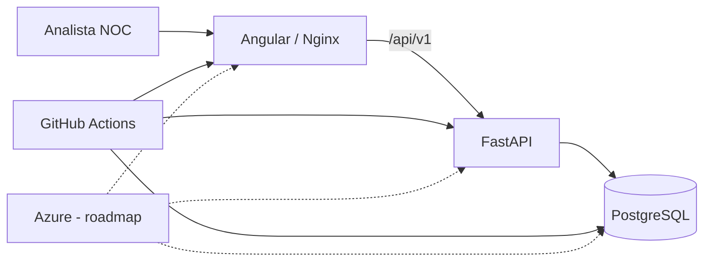

# P0 — NOC Flow Cloud v2

> Plataforma web de portfólio para o ciclo operacional de incidentes em NOC, construída com Angular, FastAPI, PostgreSQL, Docker e GitHub Actions.

**Status:** 🟢 Sprint 1 — Fundação Executável concluída tecnicamente  
**Release candidata:** `v0.1.0-alpha`  
**Autor:** Matheus Santo  
**Repositório:** `MSsanto/P0-NOC-Flow-Cloud-v2-`

## O que funciona na Sprint 1

O primeiro vertical slice executável permite:

- listar incidentes do tenant/contexto atual;
- registrar novo incidente com validação frontend e backend;
- visualizar o detalhe do incidente por ID;
- persistir dados em PostgreSQL;
- executar migrations com Alembic;
- consumir a API FastAPI pelo Angular;
- executar frontend, backend e banco via Docker Compose;
- validar type-check/lint, testes, build, dependency audits e smoke funcional no GitHub Actions.

O contexto de identidade da Sprint 1 é **somente demo em `development`/`test`**. Deploy público/produção permanece fora do escopo até autenticação e autorização reais.

## Stack executável

| Camada | Tecnologia |
|---|---|
| Frontend | Angular 22 + TypeScript |
| API | FastAPI + Python 3.12 |
| Persistência | PostgreSQL 17 + SQLAlchemy + Alembic |
| Testes | Pytest + Angular Testing/Vitest |
| Contêineres | Docker + Docker Compose |
| Web/Proxy | Nginx |
| CI | GitHub Actions |
| Segurança de dependências | `pip-audit` + `npm audit` |
| Cloud alvo | Microsoft Azure |

## Executar com Docker

Requisito: Docker com Compose.

```bash
git clone https://github.com/MSsanto/P0-NOC-Flow-Cloud-v2-.git
cd P0-NOC-Flow-Cloud-v2-
docker compose up -d --build
```

Acesse:

- Frontend: `http://localhost:4200/`
- API: `http://localhost:8000/api/v1`
- Swagger: `http://localhost:8000/api/v1/docs`
- OpenAPI JSON: `http://localhost:8000/api/v1/openapi.json`
- Readiness: `http://localhost:8000/api/v1/health/ready`
- PostgreSQL: `localhost:5432`

Para encerrar:

```bash
docker compose down -v
```

> As credenciais do Compose são exclusivamente para desenvolvimento local e não devem ser reutilizadas em staging/produção.

## Executar sem Docker

### Backend

```bash
cd backend
python -m venv .venv
# ative o ambiente virtual
python -m pip install -e ".[dev]"
alembic upgrade head
uvicorn app.main:app --reload
```

### Frontend

```bash
cd apps/web
npm install --global npm@11
npm ci
npm start
```

## Qualidade e CI

O pipeline principal executa:

```text
detect
├─ backend: install → Ruff → Alembic/PostgreSQL → pytest → pip-audit → readiness
├─ frontend: npm ci → type-check → testes → production build → npm audit
└─ compose-smoke: build stack → functional smoke → cleanup
```

O smoke funcional percorre Nginx → FastAPI → PostgreSQL e valida a jornada **criar → listar → detalhar**, além de caso negativo para campo de autoridade `tenant_id`.

Comandos locais úteis:

```bash
# backend
cd backend
ruff check .
pytest

# frontend
cd apps/web
npm run lint
npm test
npm run build
```

## API da Sprint 1

```text
GET  /api/v1/incidents
POST /api/v1/incidents
GET  /api/v1/incidents/{incident_id}
GET  /api/v1/health/live
GET  /api/v1/health/ready
```

Exemplo de criação:

```json
{
  "title": "WAN indisponível",
  "affected_resource": "DEMO-SJC-EDGE-01",
  "severity": "HIGH",
  "impact_type": "OUTAGE",
  "symptoms": "Conectividade indisponível para a unidade de demonstração.",
  "started_at": "2026-09-10T12:00:00Z"
}
```

`tenant_id`, autor, ID, timestamps e status inicial são autoridade do servidor e não são aceitos como campos do body de criação.

## Segurança da alpha

A Sprint 1 inclui tenant scoping server-side, Pydantic/constraints, CORS allowlist, Problem Details, container backend não-root, headers de segurança no Nginx e audits de dependências no CI.

A `v0.1.0-alpha` é homologável **somente como ambiente local/teste**. OIDC, RBAC e identidade confiável serão implementados em incremento posterior; por isso produção permanece bloqueada por design.

## Arquitetura resumida



## Estrutura

```text
apps/web/                   # Angular
backend/                    # FastAPI, domínio, SQLAlchemy, Alembic e testes
compose.yaml                # stack local integrada
.github/workflows/          # gates de CI
docs/                       # requisitos, arquitetura, Scrum e evidências
```

## Documentação

A documentação completa está em [`docs/INDEX.md`](docs/INDEX.md).

Destaques:

- [Sprint 1 — evidências](docs/sprints/SPRINT_01.md)
- [Roteiro de homologação da v0.1.0-alpha](docs/releases/V0.1.0-ALPHA-HOMOLOGATION.md)
- [Contrato da API](docs/06-API-CONTRACT.md)
- [Arquitetura](docs/03-ARCHITECTURE.md)
- [Modelo de dados](docs/05-DATA-MODEL.md)
- [Segurança](docs/08-SECURITY-PRIVACY.md)
- [Estratégia de testes](docs/09-TEST-STRATEGY.md)
- [ADRs](docs/adr/)

## Roadmap

- **Sprint 2:** atualizações, normalização, timeline e filtros de incidentes;
- **Sprint 3:** autenticação, RBAC e multi-tenancy confiável;
- **Sprint 4:** dashboard e passagem de turno;
- **Sprint 5:** auditoria e observabilidade;
- **Sprint 6:** Azure e release v1.0.

## Segurança e dados públicos

Não devem entrar no Git dados corporativos reais, CNPJ/endereço/telefone reais de lojas, circuitos/designações reais, contatos internos, tokens, credenciais, backups ou exports de produção.

## Licença

Projeto público de portfólio. Consulte `LICENSE.md` antes de reutilizar ou redistribuir conteúdo.
