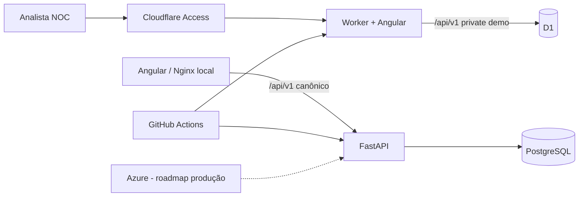

# P0 — NOC Flow Cloud v2

> Plataforma web de portfólio para o ciclo operacional de incidentes em NOC, construída com Angular, FastAPI, PostgreSQL, Docker e GitHub Actions.

**Status:** 🟢 Sprint 3 concluída; private demo Cloudflare full-stack implementada e aguardando homologação live  
**Release candidata:** `v0.3.0-beta`  
**Autor:** Matheus Santo  
**Repositório:** `MSsanto/P0-NOC-Flow-Cloud-v2-`

## O que funciona

O produto já permite:

- listar, criar e visualizar incidentes tenant-scoped;
- registrar atualizações operacionais em incidentes ativos;
- normalizar incidentes com confirmação explícita;
- bloquear atualização após `RESOLVED/CLOSED` e dupla normalização;
- visualizar timeline append-only com tipo, ator, data/hora e mensagem;
- filtrar incidentes por status, severidade e período;
- ordenar por início ou última atualização, crescente/decrescente;
- paginar resultados pela consulta avançada;
- persistir dados em PostgreSQL e executar migrations Alembic;
- executar frontend, backend e banco via Docker Compose;
- validar lint/type-check, testes, builds, audits e smoke full-stack no GitHub Actions;
- autenticar a demo privada por Cloudflare Access ou OIDC genérico;
- aplicar RBAC server-side com perfis Admin, Supervisor, Operator e Viewer;
- resolver memberships internas e bloquear acesso cross-tenant;
- executar uma private demo no Cloudflare Worker com Angular + API same-origin + D1, protegida por Cloudflare Access.

A execução local mantém um provider sintético isolado para desenvolvimento. A arquitetura canônica continua **FastAPI + PostgreSQL**. Para o ambiente de portfólio privado no plano Free, existe um adapter específico **Cloudflare Worker + D1** que preserva o contrato `/api/v1` necessário ao Angular. O código e os gates de CI dessa demo full-stack estão validados; a homologação live do backend/D1 ainda precisa ser concluída no Worker autenticado. Produção pública continua bloqueada.

## Stack executável

| Camada | Tecnologia |
|---|---|
| Frontend | Angular 22 + TypeScript |
| API | FastAPI + Python 3.12 |
| Persistência | PostgreSQL 17 + SQLAlchemy + Alembic |
| Identidade | OIDC/JWT + Cloudflare Access + RBAC |
| Testes | Pytest + Angular Testing/Vitest |
| Contêineres | Docker + Docker Compose |
| Web/Proxy | Nginx |
| CI | GitHub Actions |
| Segurança de dependências | `pip-audit` + `npm audit` |
| Private demo | Cloudflare Worker + Static Assets + D1 + Access |
| Cloud alvo de produção | Microsoft Azure (roadmap) |

## Executar com Docker

```bash
git clone https://github.com/MSsanto/P0-NOC-Flow-Cloud-v2-.git
cd P0-NOC-Flow-Cloud-v2-
docker compose up -d --build
```

Acesse:

- Frontend: `http://localhost:4200/`
- API: `http://localhost:8000/api/v1`
- Swagger: `http://localhost:8000/api/v1/docs`
- OpenAPI JSON: `http://localhost:8000/api/v1/openapi.json`
- Readiness: `http://localhost:8000/api/v1/health/ready`
- PostgreSQL: `localhost:5432`

Para encerrar e remover os dados de teste:

```bash
docker compose down -v
```

> As credenciais do Compose são exclusivamente para desenvolvimento local e não devem ser reutilizadas em staging/produção.

## Executar sem Docker

### Backend

```bash
cd backend
python -m venv .venv
# ative o ambiente virtual
python -m pip install -e ".[dev]"
alembic upgrade head
uvicorn app.main:app --reload
```

### Frontend

```bash
cd apps/web
npm install --global npm@11
npm ci
npm start
```

## Qualidade e CI

O pipeline principal executa:

```text
detect
├─ backend: install → Ruff → Alembic/PostgreSQL → pytest → pip-audit → readiness
├─ frontend: npm ci → type-check → testes → production build → npm audit
└─ compose-smoke: build stack → regressão Sprint 1 → cleanup
```

A Sprint 2 acrescenta um segundo gate funcional:

```text
Sprint 2 Functional Smoke
criar → atualizar → timeline → filtrar/paginar → normalizar
→ timeline → rejeitar dupla normalização → rejeitar update pós-resolução
```

Os smokes canônicos atravessam **Nginx → FastAPI → PostgreSQL**. O gate `Cloudflare Private Full-Stack` valida separadamente Angular, contrato do Worker API e o bundle Wrangler do adapter D1.

Comandos locais úteis:

```bash
cd backend
ruff check .
pytest

cd ../apps/web
npm run lint
npm test
npm run build
```

## API implementada

```text
GET  /api/v1/auth/me
GET  /api/v1/incidents
POST /api/v1/incidents
GET  /api/v1/incidents/query
GET  /api/v1/incidents/{incident_id}
POST /api/v1/incidents/{incident_id}/updates
POST /api/v1/incidents/{incident_id}/normalize
GET  /api/v1/incidents/{incident_id}/timeline
GET  /api/v1/health/live
GET  /api/v1/health/ready
```

`GET /api/v1/incidents` permanece retrocompatível com a listagem simples. A consulta avançada usa `GET /api/v1/incidents/query` e aceita:

```text
status
severity
started_from
started_to
page
page_size (1..100)
sort=started_at|updated_at
order=asc|desc
```

Resposta da consulta avançada:

```json
{
  "items": [],
  "page": 1,
  "page_size": 25,
  "total": 0
}
```

Atualização operacional:

```json
{
  "message": "Operadora acionada; protocolo DEMO-123."
}
```

Normalização:

```json
{
  "note": "Conectividade restabelecida e validada."
}
```

`tenant_id`, ator, ID e timestamps são autoridade do servidor. O cliente não os envia como autoridade dos comandos.

## Segurança da alpha

A candidata beta inclui validação de tokens OIDC/JWT, integração com Cloudflare Access, memberships internas, RBAC server-side, tenant scoping, Pydantic/constraints, SQLAlchemy parametrizado, CORS allowlist, Problem Details, backend não-root, headers de segurança no Nginx e audits de dependências no CI.

A timeline é append-only no fluxo suportado e as ações validam o estado do incidente. Recursos fora do tenant ativo não são expostos pela API suportada.

A `v0.3.0-beta` é homologável como ambiente local e demo privada protegida. O frontend privado em `workers.dev` já foi validado atrás do Cloudflare Access, inclusive com bloqueio em janela anônima. O adapter Worker + D1 está implementado e validado no CI, mas só será marcado como homologado após a jornada live de `/auth/me` e incidentes. Produção pública permanece bloqueada por design.

## Arquitetura resumida



## Estrutura

```text
apps/web/                   # Angular + adapter Cloudflare Worker/D1
backend/                    # FastAPI, domínio, SQLAlchemy, Alembic e testes
compose.yaml                # stack local integrada
.github/workflows/          # gates de CI
docs/                       # requisitos, arquitetura, Scrum e evidências
```

## Documentação

A documentação completa está em [`docs/INDEX.md`](docs/INDEX.md).

Destaques:

- [Sprint 2 — evidências](docs/sprints/SPRINT_02.md)
- [Sprint 3 — evidências](docs/sprints/SPRINT_03.md)
- [Roteiro de homologação da v0.2.0-alpha](docs/releases/V0.2.0-ALPHA-HOMOLOGATION.md)
- [Contrato executado de incidentes na Sprint 2](docs/api/SPRINT_02-INCIDENTS.md)
- [Contrato geral da API](docs/06-API-CONTRACT.md)
- [Arquitetura](docs/03-ARCHITECTURE.md)
- [Modelo de dados](docs/05-DATA-MODEL.md)
- [Segurança](docs/08-SECURITY-PRIVACY.md)
- [Estratégia de testes](docs/09-TEST-STRATEGY.md)
- [Cloudflare Worker + D1 — private demo full-stack](docs/deployment/CLOUDFLARE-WORKER-FULLSTACK-D1.md)
- [ADR-0009 — adapter Cloudflare Worker + D1](docs/adr/0009-cloudflare-worker-d1-private-demo.md)
- [ADRs](docs/adr/)

## Roadmap

- **Sprint 1:** fundação executável e CRUD inicial de incidentes — concluída;
- **Sprint 2:** atualizações, normalização, timeline e filtros — concluída tecnicamente;
- **Sprint 3:** autenticação, RBAC e multi-tenancy confiável — concluída tecnicamente;
- **Sprint 4:** dashboard e passagem de turno;
- **Sprint 5:** auditoria e observabilidade;
- **Sprint 6:** Azure e release v1.0.

Integrações com monitoramento/notificações (Zabbix + WhatsApp/Evolution) e ITSM (Plusoft/GLPI/Zammad) permanecem no backlog de evolução e não fazem parte da alpha atual.

## Segurança e dados públicos

Não devem entrar no Git dados corporativos reais, CNPJ/endereço/telefone reais de lojas, circuitos/designações reais, contatos internos, tokens, credenciais, backups ou exports de produção.

## Licença

Projeto público de portfólio. Consulte `LICENSE.md` antes de reutilizar ou redistribuir conteúdo.
