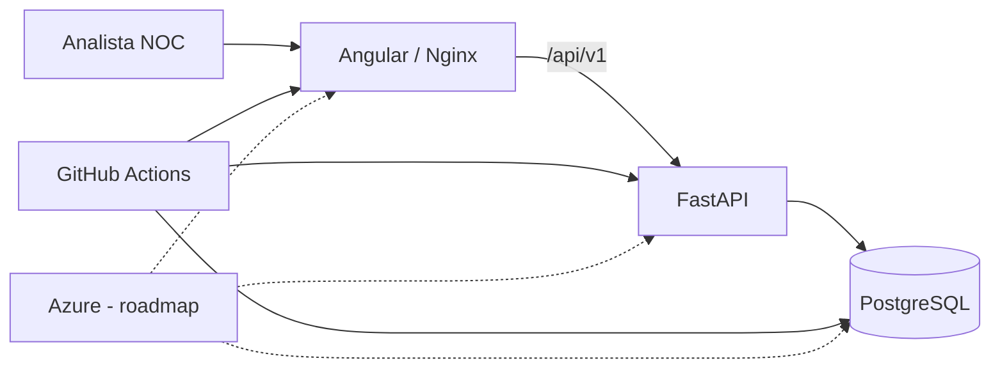

# P0 — NOC Flow Cloud v2

> Plataforma web de portfólio para o ciclo operacional de incidentes em NOC, construída com Angular, FastAPI, PostgreSQL, Docker e GitHub Actions.

**Status:** 🟢 Sprint 1 — vertical slice executável  
**Release alvo:** `v0.1.0-alpha`  
**Autor:** Matheus Santo  
**Repositório:** `MSsanto/P0-NOC-Flow-Cloud-v2-`

## O que já funciona

A Sprint 1 transforma a fundação documental em um sistema executável. O fluxo atual permite:

- listar incidentes do contexto/tenant atual;
- registrar um novo incidente;
- visualizar o detalhe pelo ID;
- persistir dados em PostgreSQL;
- validar payloads e regras básicas no FastAPI;
- consumir a API pelo Angular;
- executar frontend, backend e banco via Docker Compose;
- validar lint/type-check, testes, build, dependency audits e smoke no GitHub Actions.

O contexto de identidade da Sprint 1 é **somente demo em `development`/`test`**. Exposição pública/produção permanece bloqueada até autenticação e autorização reais.

## Stack executável

| Camada | Tecnologia |
|---|---|
| Frontend | Angular 22 + TypeScript 6 |
| API | FastAPI + Python 3.12 |
| Persistência | PostgreSQL 17 + SQLAlchemy + Alembic |
| Testes | Pytest + Angular Testing/Vitest |
| Contêineres | Docker + Docker Compose |
| Web/Proxy | Nginx |
| CI | GitHub Actions |
| Segurança de dependências | `pip-audit` + `npm audit` |
| Cloud alvo | Microsoft Azure |

## Executar com Docker

Requisitos: Docker com Compose disponível.

```bash
docker compose up -d --build
```

Serviços:

- Frontend: `http://localhost:4200/`
- API: `http://localhost:8000/api/v1`
- Swagger/OpenAPI: `http://localhost:8000/docs`
- Readiness: `http://localhost:8000/api/v1/health/ready`
- PostgreSQL local: `localhost:5432`

Parar e remover recursos locais:

```bash
docker compose down -v
```

> As credenciais padrão do Compose são exclusivamente para desenvolvimento local e não devem ser reutilizadas em staging/produção.

## Executar sem Docker

### Backend

```bash
cd backend
python -m venv .venv
# ative o ambiente virtual
python -m pip install -e ".[dev]"
alembic upgrade head
uvicorn app.main:app --reload
```

### Frontend

```bash
cd apps/web
npm install --global npm@11
npm ci
npm start
```

## Qualidade

O pipeline principal executa:

```text
detect
├─ backend: install → Ruff → Alembic/PostgreSQL → pytest → pip-audit → readiness
├─ frontend: npm ci → type-check → Vitest → production build → npm audit
└─ compose-smoke: build stack → HTTP smoke/functional checks → cleanup
```

Comandos úteis locais:

```bash
# backend
cd backend
ruff check .
pytest

# frontend
cd apps/web
npm run lint
npm test
npm run build
```

## API da Sprint 1

```text
GET  /api/v1/incidents
POST /api/v1/incidents
GET  /api/v1/incidents/{incident_id}
GET  /api/v1/health/live
GET  /api/v1/health/ready
```

Exemplo de criação:

```json
{
  "title": "WAN indisponível",
  "affected_resource": "WAN Loja 001",
  "severity": "HIGH",
  "impact_type": "OUTAGE",
  "symptoms": "Conectividade indisponível para a unidade.",
  "started_at": "2026-09-09T12:00:00Z"
}
```

`tenant_id`, autor, ID e status inicial são autoridade do servidor e não são aceitos no body de criação.

## Arquitetura resumida



Princípios mantidos:

1. dados fictícios no repositório;
2. tenant/operação como fronteira de dados;
3. API versionada;
4. validação e autorização final no backend;
5. build e testes reproduzíveis;
6. acessibilidade e baixa carga cognitiva no frontend;
7. produção não liberada sem identidade/autorização reais.

## Estrutura

```text
apps/web/                   # Angular
backend/                    # FastAPI, domínio, SQLAlchemy, Alembic e testes
compose.yaml                # stack local integrada
.github/workflows/          # gates de CI
docs/                       # arquitetura, requisitos, contratos e evidências
```

## Documentação

A documentação completa está em [`docs/INDEX.md`](docs/INDEX.md).

- [Project Charter](docs/00-PROJECT-CHARTER.md)
- [Requisitos](docs/02-REQUIREMENTS.md)
- [Arquitetura](docs/03-ARCHITECTURE.md)
- [Modelo de dados](docs/05-DATA-MODEL.md)
- [Contrato da API](docs/06-API-CONTRACT.md)
- [UX e fluxos](docs/07-UX-FLOWS.md)
- [Segurança e privacidade](docs/08-SECURITY-PRIVACY.md)
- [Estratégia de testes](docs/09-TEST-STRATEGY.md)
- [DevOps/Azure](docs/10-DEVOPS-AZURE.md)
- [Roadmap](docs/12-ROADMAP.md)
- [Backlog](docs/13-BACKLOG.md)
- [Definition of Done](docs/14-DEFINITION-OF-DONE.md)
- [Sprint 1](docs/sprints/SPRINT_01.md)
- [ADRs](docs/adr/)

## Próximas fases

- **Sprint 2:** identidade/autorização, contexto operacional e evolução do ciclo de incidentes.
- **Sprints seguintes:** timeline, dashboard, comunicados, handover, auditoria, observabilidade e Azure.

## Segurança e publicação

Não devem entrar no Git dados corporativos reais, CNPJ/endereço/telefone reais de lojas, circuitos/designações reais, contatos internos, tokens, credenciais, backups ou exports de produção.

A Sprint 1 é uma **alpha local/teste**. Não há autorização de deploy público/produção nesta etapa.

## Licença

Projeto público de portfólio. Consulte `LICENSE.md` antes de reutilizar ou redistribuir conteúdo.
