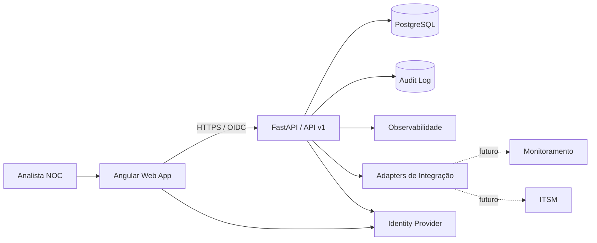

# P0 — NOC Flow Cloud v2

> Evolução cloud, multiusuário e auditável do NOC Flow, planejada antes da implementação.

**Status:** 🟦 P0 — Discovery, arquitetura e documentação  
**Código de aplicação:** ainda não iniciado  
**Autor:** Matheus Santo  
**Repositório:** `MSsanto/P0-NOC-Flow-Cloud-v2-`

## Objetivo

O NOC Flow Cloud v2 será uma plataforma web para organizar o ciclo operacional de incidentes de conectividade em um NOC: receber/registrar alertas, correlacionar eventos, preparar comunicados padronizados, acompanhar atualizações, registrar normalizações, manter histórico auditável e gerar passagem de turno.

A v2 parte dos conceitos validados no NOC Flow público, mas abandona a limitação de persistência apenas no navegador e passa a ser desenhada para colaboração entre analistas, segregação por operação, autenticação, API, banco de dados central, observabilidade e implantação em nuvem.

## Princípios do projeto

1. **Documentar antes de programar.** Arquitetura, domínio, fluxos e critérios de aceite serão definidos antes da implementação.
2. **Sem dados corporativos reais.** Repositório, testes, screenshots e seeds usarão somente dados fictícios.
3. **Multioperação desde o domínio.** Toda entidade de negócio deve respeitar isolamento por tenant/operação.
4. **Auditoria por padrão.** Alterações relevantes devem ser rastreáveis.
5. **API-first.** Front-end e integrações consomem contratos versionados.
6. **Cloud-ready, local-friendly.** Desenvolvimento local simples; produção planejada para Azure.
7. **Automação com revisão humana.** O sistema auxilia o operador, não oculta decisões operacionais.
8. **Acessibilidade e ergonomia de plantão.** Uso intenso em desktop/notebook, com navegação rápida e feedback claro.

## Stack planejada

| Camada | Tecnologia planejada |
|---|---|
| Front-end | Angular + TypeScript |
| API | FastAPI + Python |
| Persistência | PostgreSQL |
| Contratos | OpenAPI 3.x |
| Autenticação | OIDC/OAuth2, com Microsoft Entra ID como alvo de produção |
| Testes | Pytest, Angular Testing, Playwright |
| Contêineres | Docker |
| Cloud | Microsoft Azure |
| CI/CD | GitHub Actions |
| Observabilidade | Azure Application Insights / Log Analytics + logs estruturados |

> As escolhas acima são decisões de arquitetura P0 e poderão ser alteradas por ADR antes de a implementação depender delas.

## Escopo funcional planejado

- autenticação e controle de acesso por operação;
- cadastro de operações, unidades, circuitos, operadoras, contatos, severidades e templates;
- ingestão manual e futura ingestão por integração de eventos de monitoramento;
- correlação e prevenção de duplicidades;
- ciclo de incidente com alerta inicial, atualizações e normalização;
- vínculos com protocolo/ITSM e circuito;
- próximos passos operacionais;
- timeline completa do incidente;
- dashboard do plantão;
- busca, filtros e histórico;
- passagem de turno versionada;
- exportação controlada;
- trilha de auditoria;
- tema claro/escuro e acessibilidade;
- demonstração pública com dados sintéticos.

## Fora do MVP

- envio autônomo de mensagens para clientes;
- automação de ações destrutivas em operadoras ou equipamentos;
- armazenamento de credenciais de rede de clientes;
- descoberta de topologia em tempo real;
- billing/comercialização SaaS;
- machine learning para decisão operacional automática.

## Arquitetura-alvo



## Documentação

A documentação completa está em [`docs/INDEX.md`](docs/INDEX.md).

Atalhos principais:

- [Project Charter](docs/00-PROJECT-CHARTER.md)
- [Product Vision](docs/01-PRODUCT-VISION.md)
- [Requisitos](docs/02-REQUIREMENTS.md)
- [Arquitetura](docs/03-ARCHITECTURE.md)
- [Modelo de domínio](docs/04-DOMAIN-MODEL.md)
- [Modelo de dados](docs/05-DATA-MODEL.md)
- [Contrato da API v1](docs/06-API-CONTRACT.md)
- [UX e fluxos](docs/07-UX-FLOWS.md)
- [Segurança e privacidade](docs/08-SECURITY-PRIVACY.md)
- [Estratégia de testes](docs/09-TEST-STRATEGY.md)
- [DevOps/Azure](docs/10-DEVOPS-AZURE.md)
- [Observabilidade](docs/11-OBSERVABILITY.md)
- [Roadmap](docs/12-ROADMAP.md)
- [Backlog](docs/13-BACKLOG.md)
- [Definition of Done](docs/14-DEFINITION-OF-DONE.md)
- [Riscos](docs/15-RISKS.md)
- [Plano de implementação](docs/16-IMPLEMENTATION-PLAN.md)
- [Rastreabilidade](docs/17-TRACEABILITY.md)
- [ADRs](docs/adr/)

## Fases

- **P0 — Fundação:** documentação, arquitetura, domínio, backlog, ADRs e critérios de aceite.
- **P1 — Core:** autenticação, tenants, base operacional, incidentes, timeline e API.
- **P2 — Operação:** dashboard, comunicados, passagem de turno, busca, UX e auditoria.
- **P3 — Cloud:** Azure, CI/CD, observabilidade, segurança e ambiente de demonstração.
- **P4 — Integrações:** monitoramento, ITSM, webhooks e automações assistidas.

## Épicos no GitHub

- [#1 — P0 Gate: revisar e aprovar fundação](https://github.com/MSsanto/P0-NOC-Flow-Cloud-v2-/issues/1)
- [#2 — P1: fundação técnica e primeiro vertical](https://github.com/MSsanto/P0-NOC-Flow-Cloud-v2-/issues/2)
- [#3 — P2: MVP operacional](https://github.com/MSsanto/P0-NOC-Flow-Cloud-v2-/issues/3)
- [#4 — P3: Azure, CI/CD e observabilidade](https://github.com/MSsanto/P0-NOC-Flow-Cloud-v2-/issues/4)
- [#5 — P4: integrações e automações assistidas](https://github.com/MSsanto/P0-NOC-Flow-Cloud-v2-/issues/5)

## Estrutura reservada

```text
apps/
  web/      # Angular — sem código durante P0
  api/      # FastAPI — sem código durante P0
infra/      # IaC/Cloud — sem provisionamento durante P0
tests/      # E2E/contract/security — apenas planejamento durante P0
docs/       # fonte de verdade documental
```

## Regra atual

**Nenhuma feature de aplicação deve ser implementada enquanto o P0 documental não estiver aprovado.** Neste momento, o repositório é deliberadamente documentation-first.

## Segurança e publicação

Todo conteúdo publicado deve ser fictício. Não devem entrar no Git: clientes reais, nomes de lojas/unidades reais, CNPJ, endereços, telefones, circuitos, designações, contatos internos, tokens, credenciais, backups operacionais ou exports de produção.

## Licença

Projeto público de portfólio. A visibilidade pública não concede automaticamente direito de reutilização. Consulte `LICENSE.md` antes de copiar ou redistribuir conteúdo.
