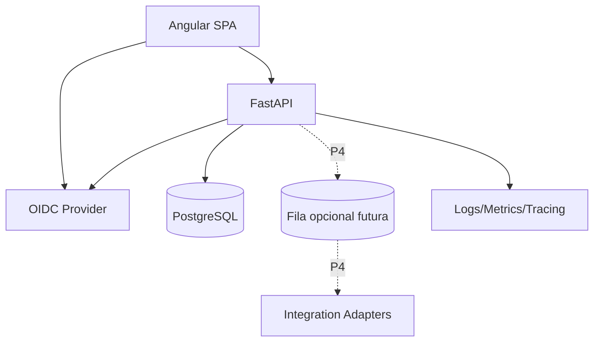

# Arquitetura

## Estilo

Arquitetura inicialmente **modular monolith** com front-end separado da API. A escolha evita complexidade prematura de microserviços e mantém limites de domínio explícitos para futura extração se houver necessidade real.

## Containers lógicos



## Módulos de backend planejados

- `identity`: usuário autenticado, memberships e roles;
- `tenancy`: tenant/operação e políticas de isolamento;
- `operations`: unidades, circuitos, operadoras, contatos e severidades;
- `incidents`: agregado de incidente e transições;
- `communications`: templates, renderização e histórico;
- `handover`: geração e versionamento de passagem de turno;
- `audit`: trilha de ações relevantes;
- `integrations`: portas/adapters para monitoramento e ITSM;
- `observability`: health, métricas e contexto de request.

## Camadas no backend

```text
API/HTTP
  ↓
Application / Use Cases
  ↓
Domain
  ↓
Repositories / Infrastructure
  ↓
PostgreSQL + integrações
```

O domínio não deve importar FastAPI, SQLAlchemy ou SDK Azure.

## Front-end planejado

Organização por features:

```text
app/
  core/
  shared/
  features/
    dashboard/
    incidents/
    operations/
    handover/
    administration/
    audit/
```

Regras de domínio críticas permanecem no backend. O front-end replica somente validações de UX, nunca a autorização final.

## Multi-tenancy

Estratégia inicial: banco compartilhado e schema compartilhado, com `tenant_id` obrigatório nas tabelas de negócio.

Defesas:

1. tenant resolvido a partir do usuário autenticado e contexto selecionado;
2. services/repositories recebem tenant explicitamente;
3. constraints e índices compostos incluem tenant quando necessário;
4. testes automáticos de cross-tenant leakage;
5. possibilidade de PostgreSQL RLS como camada adicional após validação do desenho.

Nenhum `tenant_id` enviado pelo cliente deve ser confiado sem validação contra memberships do usuário.

## Consistência

- timestamps persistidos em UTC;
- UUID/ULID para identificadores públicos, decisão final em ADR de implementação;
- versionamento otimista em entidades administrativas sujeitas a conflito;
- transações em transições de incidente e handover;
- auditoria gravada na mesma transação quando a ação exigir atomicidade.

## Integrações

Integrações externas entram por adapters. O domínio não conhece ServiceNow, Zabbix ou outra marca específica.

```text
MonitoringWebhook -> NormalizedEvent -> Correlation -> Incident
ITSMAdapter        <- Incident/Protocol synchronization
NotificationAdapter <- rendered communication (future)
```

## Por que não microserviços agora

- equipe/projeto pequeno;
- domínio ainda evoluindo;
- custo operacional maior;
- debugging e transações distribuídas desnecessários;
- modular monolith já permite fronteiras claras.

Uma extração futura exige evidência: escala independente, ownership distinto, gargalo de deploy ou isolamento obrigatório.