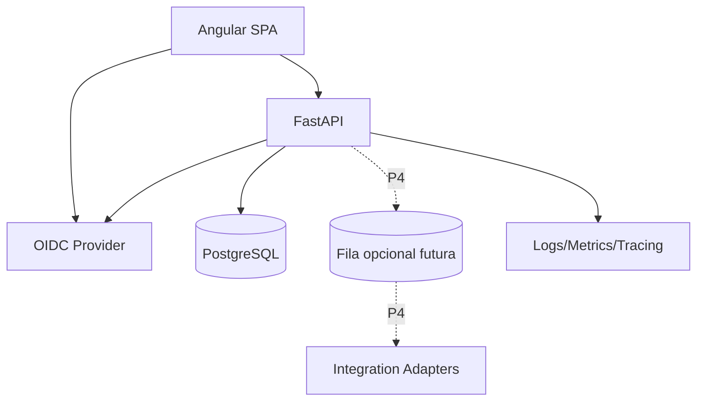

# Arquitetura

## Estilo

Arquitetura inicialmente **modular monolith** com front-end separado da API. A escolha evita complexidade prematura de microserviços e mantém limites de domínio explícitos para futura extração se houver necessidade real.

## Containers lógicos



## Princípios arquiteturais

1. **Modularizar antes de distribuir.** O backend possui uma única unidade de deploy enquanto os limites internos permanecem explícitos.
2. **Regra de negócio crítica no backend.** O Angular pode repetir validações para UX, mas não é fonte de verdade para autorização, transição de estado ou isolamento de tenant.
3. **Dependências apontam para dentro.** Domínio e casos de uso não importam FastAPI, SQLAlchemy, Azure SDK ou implementações concretas de integração.
4. **Contratos explícitos.** A API HTTP é versionada em `/api/v1`, documentada em OpenAPI e possui formato de erro uniforme.
5. **Cloud sem acoplamento de domínio.** Azure hospeda a solução, mas regras de negócio não dependem do provedor.
6. **Simplicidade operacional.** Novas filas, caches, workers ou serviços somente entram com problema mensurável que justifique o custo.

## Módulos de backend planejados

- `identity`: usuário autenticado, memberships e roles;
- `tenancy`: tenant/operação e políticas de isolamento;
- `operations`: unidades, circuitos, operadoras, contatos e severidades;
- `incidents`: agregado de incidente e transições;
- `communications`: templates, renderização e histórico;
- `handover`: geração e versionamento de passagem de turno;
- `audit`: trilha de ações relevantes;
- `integrations`: portas/adapters para monitoramento e ITSM;
- `observability`: health, métricas e contexto de request.

## Camadas no backend

```text
API/HTTP
  ↓
Application / Use Cases
  ↓
Domain
  ↓
Repositories / Infrastructure
  ↓
PostgreSQL + integrações
```

O domínio não deve importar FastAPI, SQLAlchemy ou SDK Azure.

### Estrutura de diretórios do backend

Estrutura alvo para a Sprint 1 e evolução incremental:

```text
backend/
  app/
    main.py
    core/
      config.py
      security.py
      errors.py
      logging.py
    api/
      v1/
        router.py
    modules/
      incidents/
        domain/
        application/
        infrastructure/
        presentation/
      identity/
      tenancy/
      operations/
      handover/
      audit/
    db/
      session.py
  alembic/
  tests/
    unit/
    integration/
    api/
```

Regras:

- `domain` contém entidades, value objects e invariantes sem dependência de framework;
- `application` contém casos de uso e portas necessárias ao domínio/aplicação;
- `infrastructure` implementa persistência e integrações;
- `presentation` expõe schemas/routers HTTP do módulo;
- `api/v1/router.py` apenas compõe routers da versão da API;
- rotas não concentram regra de negócio;
- módulos não acessam tabelas internas de outro módulo diretamente para contornar seu contrato;
- transações são delimitadas por caso de uso; não será introduzido um framework genérico de Unit of Work até existir necessidade concreta.

## Front-end planejado

Organização por features:

```text
frontend/src/app/
  core/
    auth/
    config/
    guards/
    http/
  shared/
    ui/
    models/
    pipes/
    utils/
  features/
    dashboard/
    incidents/
      pages/
      components/
      data-access/
      models/
    operations/
    handover/
    administration/
    audit/
```

Regras:

- `core` contém serviços singleton e infraestrutura transversal da SPA;
- `shared` contém elementos reutilizáveis sem regra específica de uma feature;
- cada feature concentra páginas, componentes locais, modelos e acesso à API necessários àquela capacidade;
- uma feature não importa internals de outra feature; integração ocorre por routing, contratos compartilhados mínimos ou serviços de aplicação apropriados;
- componentes de página orquestram fluxo; componentes de UI permanecem preferencialmente apresentacionais;
- chamadas HTTP ficam em `data-access`, não espalhadas pelos componentes;
- regras de domínio críticas permanecem no backend. O front-end replica somente validações de UX, nunca a autorização final.

## API e contratos

- prefixo de versão principal: `/api/v1`;
- OpenAPI gerado pelo FastAPI é o contrato executável;
- mudanças aditivas compatíveis permanecem em `v1`;
- mudanças incompatíveis de contrato exigem nova versão principal (`/api/v2`) ou estratégia explícita de migração;
- endpoints removidos devem passar por depreciação documentada quando houver consumidor ativo;
- IDs, timestamps, paginação e códigos HTTP seguem `docs/06-API-CONTRACT.md`.

### Tratamento de erros

Erros HTTP seguem **Problem Details compatível com RFC 9457**. O backend mapeia exceções conhecidas para respostas estáveis e não expõe stack trace, SQL, tokens ou detalhes internos.

Campos mínimos do erro:

```json
{
  "type": "https://nocflow.example/problems/incident-state-conflict",
  "title": "Incident state conflict",
  "status": 409,
  "detail": "The incident cannot transition from CLOSED to RESOLVED.",
  "instance": "/api/v1/incidents/01J.../resolve",
  "code": "INCIDENT_STATE_CONFLICT",
  "request_id": "01J..."
}
```

Erros de validação podem acrescentar `errors` com campos e mensagens normalizadas. `request_id` deve permitir correlação com logs sem revelar dados sensíveis.

## Multi-tenancy

Estratégia inicial: banco compartilhado e schema compartilhado, com `tenant_id` obrigatório nas tabelas de negócio.

Defesas:

1. tenant resolvido a partir do usuário autenticado e contexto selecionado;
2. services/repositories recebem tenant explicitamente;
3. constraints e índices compostos incluem tenant quando necessário;
4. testes automáticos de cross-tenant leakage;
5. possibilidade de PostgreSQL RLS como camada adicional após validação do desenho.

Nenhum `tenant_id` enviado pelo cliente deve ser confiado sem validação contra memberships do usuário.

## Segurança arquitetural

- autenticação por OIDC/OAuth2; Microsoft Entra ID é o alvo Azure;
- autorização server-side baseada em memberships/roles internos;
- frontend pode ocultar ações proibidas, mas não substitui autorização da API;
- secrets permanecem fora do repositório e, em Azure, devem ser obtidos por configuração segura/Key Vault;
- CORS utiliza allowlist por ambiente;
- recursos de outro tenant não são enumeráveis por usuário comum;
- tokens, secrets e payloads sensíveis não entram em logs.

## Consistência

- timestamps persistidos em UTC;
- UUID/ULID para identificadores públicos, decisão final em ADR de implementação;
- versionamento otimista em entidades administrativas sujeitas a conflito;
- transações em transições de incidente e handover;
- auditoria gravada na mesma transação quando a ação exigir atomicidade.

## Integrações

Integrações externas entram por adapters. O domínio não conhece ServiceNow, Zabbix ou outra marca específica.

```text
MonitoringWebhook -> NormalizedEvent -> Correlation -> Incident
ITSMAdapter        <- Incident/Protocol synchronization
NotificationAdapter <- rendered communication (future)
```

## Azure

Topologia alvo de baixo custo:

```text
Azure Static Web Apps (Angular)
          ↓ HTTPS
Azure Container Apps (FastAPI)
          ↓
Azure Database for PostgreSQL
          ├── Key Vault
          └── Application Insights / Log Analytics
```

A API deve permanecer stateless para permitir escala horizontal. Sessão e autorização não podem depender de memória local do container. A escolha final dos SKUs e IaC pertence à execução DevOps, respeitando `docs/10-DEVOPS-AZURE.md`.

## Observabilidade

Cada request recebe ou propaga `X-Request-ID`. Logs estruturados devem registrar ao menos timestamp, nível, request ID, módulo, operação e resultado, sem secrets. Health checks são separados em:

- `/health/live`: processo está vivo;
- `/health/ready`: dependências obrigatórias permitem atender tráfego.

Métricas e tracing serão instrumentados de forma compatível com Application Insights/OpenTelemetry sem acoplar o domínio ao SDK.

## Escalabilidade

A ordem de evolução é deliberadamente simples:

1. otimizar queries e índices;
2. dimensionar pool/conexões e recursos do container;
3. escalar horizontalmente a API stateless;
4. introduzir cache apenas para leitura com benefício mensurável;
5. introduzir worker/fila somente para processamento assíncrono real;
6. considerar extração de módulo para serviço apenas diante de necessidade comprovada.

## Por que não microserviços agora

- equipe/projeto pequeno;
- domínio ainda evoluindo;
- custo operacional maior;
- debugging e transações distribuídas desnecessários;
- modular monolith já permite fronteiras claras.

Uma extração futura exige evidência: escala independente, ownership distinto, gargalo de deploy ou isolamento obrigatório.
