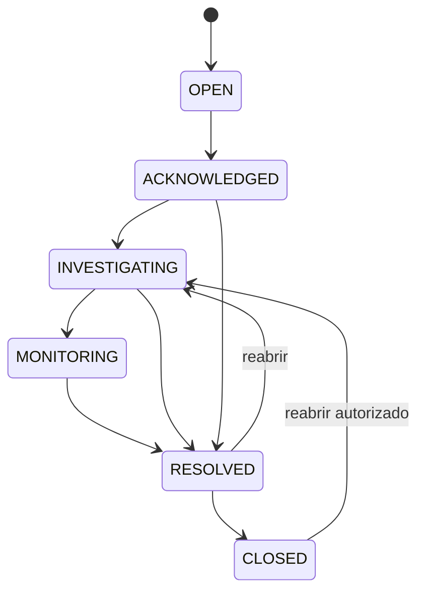

# Modelo de domínio

## Agregado principal: Incident

`Incident` representa uma ocorrência operacional acompanhada do início ao encerramento.

Campos conceituais:

- id;
- tenant_id;
- incident_key/human_id;
- site_id;
- severity_id;
- status;
- source;
- detected_at;
- acknowledged_at;
- resolved_at;
- closed_at;
- current_summary;
- owner_user_id opcional;
- created_by;
- created_at;
- version.

## Estados

### Significado

- `OPEN`: registrado, ainda não assumido;
- `ACKNOWLEDGED`: analista reconheceu o incidente;
- `INVESTIGATING`: atuação em curso;
- `MONITORING`: serviço aparenta estar estável, aguardando confirmação;
- `RESOLVED`: normalização registrada;
- `CLOSED`: encerramento administrativo.

A UI pode usar os termos “Alerta”, “Atualização” e “Normalização”, mas estes são tipos de comunicação/evento, não tabelas independentes sem relação.

## Eventos da timeline

Tipos iniciais:

- `INCIDENT_CREATED`;
- `ACKNOWLEDGED`;
- `STATUS_CHANGED`;
- `INITIAL_ALERT_RECORDED`;
- `UPDATE_RECORDED`;
- `PROTOCOL_LINKED`;
- `NEXT_ACTION_CHANGED`;
- `COMMUNICATION_RENDERED`;
- `RESOLUTION_RECORDED`;
- `INCIDENT_REOPENED`;
- `INCIDENT_CLOSED`;
- `COMMENT_ADDED`.

Eventos de timeline não devem ser reescritos para “corrigir a história”. Correções são novos eventos.

## Entidades de apoio

### Tenant
Operação logicamente isolada.

### Membership
Relação usuário ↔ tenant com papel.

### Site
Unidade/localidade fictícia ou real somente em ambientes privados autorizados.

### Circuit
Circuito WAN/serviço associado a site e operadora.

### Carrier
Operadora/provedor.

### Contact
Contato operacional controlado por tenant.

### Severity
Nome, ordem, prazo alvo e regras visuais configuráveis.

### CommunicationTemplate
Template versionado por tipo e tenant.

### Shift
Janela operacional calculada a partir da configuração do tenant.

### Handover
Snapshot versionado produzido para uma troca de turno.

### AuditEvent
Registro de segurança/governança separado da timeline de negócio.

## Invariantes

1. incident/site/severity precisam pertencer ao mesmo tenant;
2. somente transições permitidas podem mudar estado;
3. resolver exige `resolved_at` e registro de resolução;
4. reabrir exige justificativa;
5. handover finalizado não é alterado; nova edição gera versão;
6. template renderizado preserva conteúdo final e versão do template;
7. IDs externos de integração não podem colidir dentro do mesmo tenant/provedor.