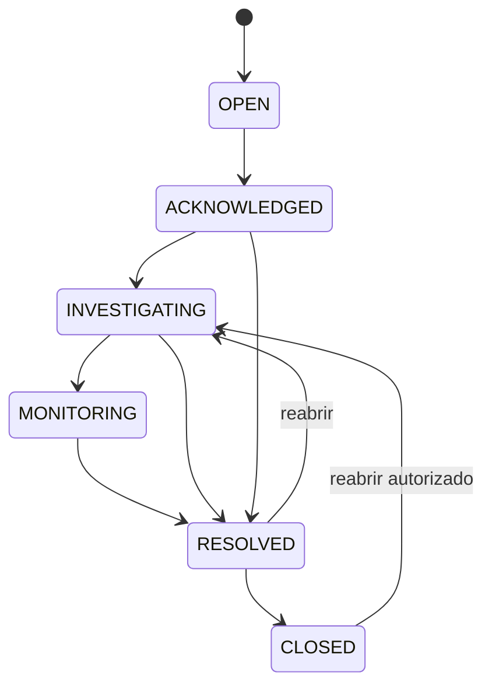

# Modelo de domínio

## Agregado principal: Incident

`Incident` representa uma ocorrência operacional acompanhada do início ao encerramento.

Campos conceituais:

- id;
- tenant_id;
- incident_key/human_id;
- site_id;
- severity_id;
- status;
- source;
- detected_at;
- acknowledged_at;
- resolved_at;
- closed_at;
- current_summary;
- owner_user_id opcional;
- created_by;
- created_at;
- version.

## Estados

### Significado

- `OPEN`: registrado, ainda não assumido;
- `ACKNOWLEDGED`: analista reconheceu o incidente;
- `INVESTIGATING`: atuação em curso;
- `MONITORING`: serviço aparenta estar estável, aguardando confirmação;
- `RESOLVED`: normalização registrada;
- `CLOSED`: encerramento administrativo.

A UI pode usar os termos “Alerta”, “Atualização” e “Normalização”, mas estes são tipos de comunicação/evento, não tabelas independentes sem relação.

## Eventos da timeline

Tipos iniciais:

- `INCIDENT_CREATED`;
- `ACKNOWLEDGED`;
- `STATUS_CHANGED`;
- `INITIAL_ALERT_RECORDED`;
- `UPDATE_RECORDED`;
- `PROTOCOL_LINKED`;
- `NEXT_ACTION_CHANGED`;
- `COMMUNICATION_RENDERED`;
- `RESOLUTION_RECORDED`;
- `INCIDENT_REOPENED`;
- `INCIDENT_CLOSED`;
- `COMMENT_ADDED`.

Eventos de timeline não devem ser reescritos para “corrigir a história”. Correções são novos eventos.

## Entidades de apoio

### Tenant
Operação logicamente isolada.

### Membership
Relação usuário ↔ tenant com papel.

### Site
Unidade/localidade fictícia ou real somente em ambientes privados autorizados.

### Circuit
Circuito WAN/serviço associado a site e operadora.

### Carrier
Operadora/provedor.

### Contact
Contato operacional controlado por tenant.

### Severity
Nome, ordem, prazo alvo e regras visuais configuráveis.

### CommunicationTemplate
Template versionado por tipo e tenant.

### Shift
Na Sprint 4, `Shift` é um value object calculado e não uma entidade persistente.

Entradas:

- `Tenant.timezone`;
- `Tenant.shift_start_local`;
- `Tenant.shift_duration_minutes`;
- instante atual fornecido pelo clock da aplicação.

Saída:

- `window_start` UTC;
- `window_end` UTC.

O cálculo deve respeitar timezone IANA e mudanças de horário civil/DST.

### Handover
Snapshot versionado produzido para uma troca de turno.

Campos conceituais da Sprint 4:

- id;
- tenant_id;
- window_start;
- window_end;
- version;
- observations;
- finalized_by_subject;
- finalized_at;
- created_at.

Um handover finalizado é imutável. Correções ou complementos geram nova versão para a mesma janela.

### HandoverItem
Item imutável do snapshot associado a um incidente.

Campos conceituais da Sprint 4:

- id;
- handover_id;
- incident_id;
- title_snapshot;
- affected_resource_snapshot;
- severity_snapshot;
- status_snapshot;
- started_at_snapshot;
- last_event_message_snapshot opcional;
- last_event_at_snapshot opcional.

O item guarda somente campos disponíveis no domínio executável. Protocolos, próximo passo e outras informações estruturadas só entram quando seus respectivos incrementos existirem.

### AuditEvent
Registro de segurança/governança separado da timeline de negócio.

## Invariantes

1. incident/site/severity precisam pertencer ao mesmo tenant;
2. somente transições permitidas podem mudar estado;
3. resolver exige `resolved_at` e registro de resolução;
4. reabrir exige justificativa;
5. handover finalizado não é alterado; correção gera nova versão;
6. versão de handover é monotônica por tenant + janela de turno;
7. handover e seus itens são persistidos atomicamente;
8. item de handover preserva o snapshot mesmo que o incidente evolua depois;
9. template renderizado preserva conteúdo final e versão do template;
10. IDs externos de integração não podem colidir dentro do mesmo tenant/provedor.

## Regras de seleção do handover — Sprint 4

O preview/finalização considera:

- incidentes ativos no momento da geração: qualquer status diferente de `RESOLVED` e `CLOSED`;
- incidentes normalizados no turno: incidentes com evento `INCIDENT_NORMALIZED` ocorrido entre `window_start` e `window_end`;
- união sem duplicidade por `incident_id`.

A finalização recalcula server-side o conjunto do snapshot. A lista de itens não é aceita do cliente como autoridade.
