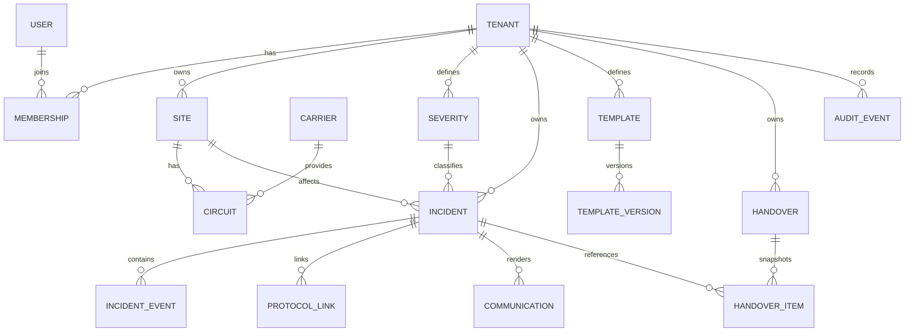

# Modelo lógico de dados

## ER inicial

## Tabelas P1

### tenants
`id`, `slug`, `name`, `timezone`, `is_active`, `created_at`, `updated_at`.

### users
`id`, `external_subject`, `email_normalized`, `display_name`, `is_active`, timestamps.

### memberships
`tenant_id`, `user_id`, `role`, `is_active`, timestamps. Unique `(tenant_id,user_id)`.

### sites
`id`, `tenant_id`, `code`, `name`, `region`, `is_active`, metadata controlada. Unique `(tenant_id,code)`.

### carriers
`id`, `tenant_id`, `code`, `name`, `is_active`.

### circuits
`id`, `tenant_id`, `site_id`, `carrier_id`, `label`, `service_type`, `designation`, `is_active`. Em repositório público, designations de seed devem ser explicitamente sintéticas.

### severities
`id`, `tenant_id`, `code`, `name`, `priority`, `target_update_minutes`, `is_active`.

### incidents
`id`, `tenant_id`, `human_id`, `site_id`, `severity_id`, `status`, `source`, `detected_at`, `acknowledged_at`, `resolved_at`, `closed_at`, `current_summary`, `owner_user_id`, `created_by`, `created_at`, `updated_at`, `version`.

### incident_events
`id`, `tenant_id`, `incident_id`, `event_type`, `occurred_at`, `actor_user_id`, `payload_json`, `created_at`.

### protocol_links
`id`, `tenant_id`, `incident_id`, `provider`, `external_id`, `url_optional`, `created_at`. Unique `(tenant_id,provider,external_id)` quando aplicável.

## Tabelas P2

### templates / template_versions
Separar identidade do template da versão imutável. Version contém `body`, `schema_version`, `created_by`, `created_at`.

### communications
Preserva `template_version_id`, `incident_id`, `type`, `rendered_body`, `created_by`, `created_at`.

### handovers
`id`, `tenant_id`, `shift_start`, `shift_end`, `version`, `status`, `notes`, `created_by`, `created_at`, `finalized_at`.

### handover_items
Snapshot dos incidentes: estado, resumo, próximo passo e referência ao incidente.

### audit_events
`id`, `tenant_id`, `actor_user_id`, `action`, `resource_type`, `resource_id`, `before_json`, `after_json`, `request_id`, `created_at`.

## Índices iniciais

- incidents `(tenant_id,status,detected_at desc)`;
- incidents `(tenant_id,site_id,status)`;
- incident_events `(tenant_id,incident_id,occurred_at)`;
- protocol_links `(tenant_id,provider,external_id)`;
- sites `(tenant_id,code)`;
- circuits `(tenant_id,site_id,is_active)`;
- audit_events `(tenant_id,created_at desc)`.

## Retenção

Retenção real dependerá do ambiente. No portfólio/demo, usar dados sintéticos e política simples. Em operação real, retenção deve ser definida com requisitos legais, contratuais e de privacidade antes de produção.