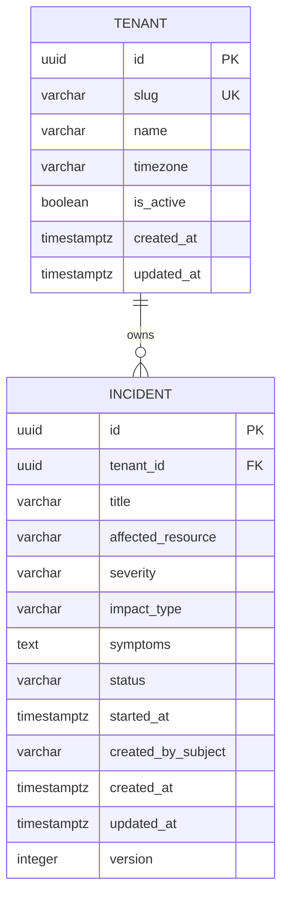
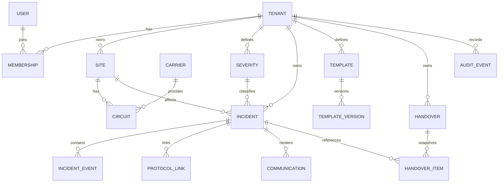

# Modelo de dados

## Objetivo

Definir o modelo de dados do NOC Flow Cloud v2 com foco em integridade, isolamento por tenant, rastreabilidade, migrations reproduzíveis e evolução compatível com o roadmap.

A Sprint 1 usa um recorte mínimo e executável do domínio. Entidades futuras permanecem documentadas, mas não devem ser antecipadas no schema sem necessidade da sprint.

## Decisões vigentes

- SGBD: PostgreSQL.
- Estratégia multi-tenant: banco compartilhado e schema compartilhado.
- `tenant_id` é obrigatório em tabelas de negócio.
- Timestamps persistidos como `timestamptz` em UTC.
- Exclusão física de tenant com dados operacionais deve ser bloqueada por FK (`ON DELETE RESTRICT`).
- Incidentes não usam soft delete na Sprint 1; histórico operacional não deve desaparecer silenciosamente.
- Valores de domínio de baixa cardinalidade serão persistidos como `varchar` + `CHECK` na fase inicial. Isso evita o acoplamento de migrations a PostgreSQL ENUM durante a evolução rápida do domínio.
- Identificadores públicos usam tipo `uuid`. A geração definitiva no banco ou na aplicação depende da ADR de implementação da arquitetura; o schema não depende de uma extensão PostgreSQL específica.

## Sprint 1 — escopo físico

Entidades obrigatórias:

1. `tenants`;
2. `incidents`.

O objetivo é suportar US-001, US-002 e US-003 sem antecipar `users`, `memberships`, `sites`, `severities` configuráveis, timeline ou auditoria completa.

### ER — Sprint 1

## `tenants`

| Campo | Tipo | Null | Regra |
|---|---|---:|---|
| `id` | `uuid` | não | PK |
| `slug` | `varchar(64)` | não | unique; 2–64 caracteres |
| `name` | `varchar(120)` | não | 2–120 caracteres |
| `timezone` | `varchar(64)` | não | default `UTC`; valor IANA validado pela aplicação |
| `is_active` | `boolean` | não | default `true` |
| `created_at` | `timestamptz` | não | default `CURRENT_TIMESTAMP` |
| `updated_at` | `timestamptz` | não | default `CURRENT_TIMESTAMP` |

Constraints propostas:

- `PRIMARY KEY (id)`;
- `UNIQUE (slug)`;
- `CHECK (char_length(slug) BETWEEN 2 AND 64)`;
- `CHECK (char_length(name) BETWEEN 2 AND 120)`;
- `CHECK (updated_at >= created_at)`.

## `incidents`

| Campo | Tipo | Null | Regra |
|---|---|---:|---|
| `id` | `uuid` | não | PK |
| `tenant_id` | `uuid` | não | FK → `tenants.id`; `ON DELETE RESTRICT` |
| `title` | `varchar(120)` | não | 3–120 caracteres |
| `affected_resource` | `varchar(120)` | não | 2–120 caracteres |
| `severity` | `varchar(16)` | não | `CRITICAL`, `HIGH`, `MEDIUM`, `LOW` |
| `impact_type` | `varchar(16)` | não | `OUTAGE`, `DEGRADATION` |
| `symptoms` | `text` | não | 10–2000 caracteres |
| `status` | `varchar(24)` | não | default `OPEN`; conjunto de estados aprovado no domínio |
| `started_at` | `timestamptz` | não | não pode ser posterior a `created_at` |
| `created_by_subject` | `varchar(255)` | não | identificador confiável do ator resolvido pelo backend; nunca recebido como autoridade do cliente |
| `created_at` | `timestamptz` | não | default `CURRENT_TIMESTAMP` |
| `updated_at` | `timestamptz` | não | default `CURRENT_TIMESTAMP` |
| `version` | `integer` | não | default `1`; reservado para concorrência otimista |

Estados atualmente documentados no domínio:

- `OPEN`;
- `ACKNOWLEDGED`;
- `INVESTIGATING`;
- `MONITORING`;
- `RESOLVED`;
- `CLOSED`.

Constraints propostas:

- `PRIMARY KEY (id)`;
- `FOREIGN KEY (tenant_id) REFERENCES tenants(id) ON DELETE RESTRICT`;
- `CHECK (char_length(title) BETWEEN 3 AND 120)`;
- `CHECK (char_length(affected_resource) BETWEEN 2 AND 120)`;
- `CHECK (severity IN ('CRITICAL','HIGH','MEDIUM','LOW'))`;
- `CHECK (impact_type IN ('OUTAGE','DEGRADATION'))`;
- `CHECK (char_length(symptoms) BETWEEN 10 AND 2000)`;
- `CHECK (status IN ('OPEN','ACKNOWLEDGED','INVESTIGATING','MONITORING','RESOLVED','CLOSED'))`;
- `CHECK (started_at <= created_at)`;
- `CHECK (updated_at >= created_at)`;
- `CHECK (version >= 1)`.

### Compatibilidade com autenticação futura

Na Sprint 1, `created_by_subject` evita criar antecipadamente o agregado de identidade. Quando `users` e `memberships` entrarem na Sprint 3, a migration deverá usar estratégia expand/contract:

1. adicionar `created_by_user_id` nullable;
2. backfill pela correspondência com `users.external_subject`;
3. validar cobertura;
4. tornar FK/not-null quando aplicável;
5. retirar `created_by_subject` somente em migration posterior e após compatibilidade do backend.

Nenhuma migration deve combinar inclusão da nova coluna, backfill e remoção destrutiva da antiga em um único deploy de produção.

## Índices — Sprint 1

### `incidents`

1. `idx_incidents_tenant_started_at`
   - `(tenant_id, started_at DESC, created_at DESC)`
   - suporta US-001: listagem do tenant em ordem temporal.

2. `idx_incidents_tenant_status_started_at`
   - `(tenant_id, status, started_at DESC)`
   - prepara listagens operacionais e evolução da Sprint 2 sem índice global que atravesse tenants.

3. `UNIQUE (tenant_id, id)`
   - redundante para unicidade global do UUID, mas deliberado para permitir FKs compostas futuras que garantam pertencimento ao mesmo tenant em tabelas filhas, como `incident_events`.

Não criar índices adicionais sem padrão de consulta demonstrado. Cada índice aumenta custo de escrita e manutenção.

## Estratégia de migrations

As migrations são versionadas no repositório e fazem parte do artefato de deploy.

Regras:

- cada alteração de schema possui migration explícita;
- migrations devem ser determinísticas e reproduzíveis;
- mudanças destrutivas usam expand/contract;
- adicionar coluna obrigatória em tabela populada exige etapa intermediária nullable/default/backfill antes de `NOT NULL`;
- criação de índice pesado em ambiente de produção deve considerar `CONCURRENTLY` quando o mecanismo de migration permitir;
- rollback de produção não deve depender de apagar dados recém-gravados; quando necessário, preferir correção forward;
- downgrade destrutivo é aceitável apenas em ambientes descartáveis e deve ser documentado;
- schema e aplicação devem permanecer compatíveis durante deploy rolling quando aplicável.

### TASK-DB-004

A implementação executável da primeira migration deve ser criada junto da fundação real da API/ORM. Enquanto `apps/api` estiver explicitamente reservado sem código executável, este documento funciona como contrato de schema para a migration inicial.

Framework recomendado para o stack FastAPI + SQLAlchemy: Alembic, sujeito à confirmação final da fundação de backend/arquitetura.

## Retenção e auditoria

Sprint 1:

- não excluir incidentes por fluxo funcional;
- dados do projeto público devem ser sintéticos;
- tenant inativo permanece referenciável para preservar histórico.

Roadmap:

- `incident_events` será append-only para timeline operacional;
- `audit_events` será trilha separada para governança/segurança;
- política de retenção de produção depende de requisitos legais, contratuais e de privacidade antes da entrada em produção real.

## Modelo alvo do roadmap

Entidades do roadmap não devem ser criadas na Sprint 1 apenas por estarem previstas. A evolução ocorrerá por migrations conforme histórias aprovadas.

## Checklist de integridade para alterações futuras

Toda mudança de schema deve responder:

1. Qual requisito/história exige a alteração?
2. O modelo continua isolando tenant corretamente?
3. Existe risco de perda ou corrupção de dados?
4. A migration é compatível com a versão anterior da aplicação durante o deploy?
5. É necessário backfill?
6. Índices cobrem consultas reais sem excesso?
7. Existe estratégia de rollback ou correção forward?
8. A alteração preserva rastreabilidade/auditoria?
9. Backend e Product Owner precisam validar alguma mudança de regra de negócio?
