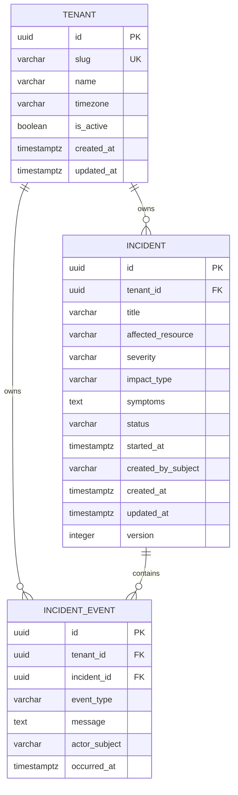
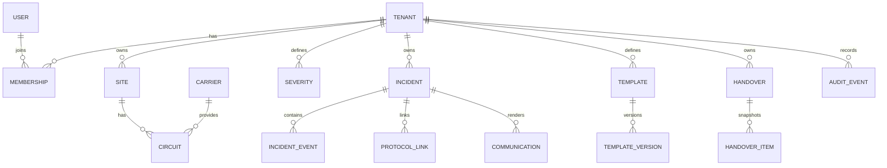

# Modelo de dados

## Objetivo

Definir o modelo físico vigente do NOC Flow Cloud v2 com foco em integridade, isolamento por tenant, rastreabilidade, migrations reproduzíveis e evolução compatível com o roadmap.

**Estado atual:** Sprint 2 concluída tecnicamente. O schema executável possui `tenants`, `incidents` e `incident_events`.

## Decisões vigentes

- SGBD: PostgreSQL 17.
- ORM: SQLAlchemy; migrations: Alembic.
- Estratégia multi-tenant: banco e schema compartilhados, `tenant_id` obrigatório nas tabelas operacionais.
- Timestamps persistidos em UTC (`timestamptz`).
- Dados operacionais usam UUID.
- Valores de domínio de baixa cardinalidade usam `varchar` + constraints/checks quando aplicável.
- O incidente representa o estado corrente; `incident_events` representa a trilha cronológica operacional.
- A timeline é append-only no fluxo suportado: não existe endpoint de update/delete de evento.
- Dados públicos/de portfólio devem ser exclusivamente sintéticos.

## ER — estado após Sprint 2



## `tenants`

| Campo | Regra principal |
|---|---|
| `id` | UUID, PK |
| `slug` | identificador único do tenant |
| `name` | nome do tenant |
| `timezone` | timezone IANA; default operacional UTC |
| `is_active` | flag de ativação |
| `created_at` / `updated_at` | timestamps de auditoria básica |

O tenant não deve ser removido fisicamente enquanto possuir dados operacionais relacionados.

## `incidents`

| Campo | Regra principal |
|---|---|
| `id` | UUID, PK |
| `tenant_id` | obrigatório; FK para tenant |
| `title` | 3–120 caracteres |
| `affected_resource` | 2–120 caracteres |
| `severity` | `CRITICAL`, `HIGH`, `MEDIUM`, `LOW` |
| `impact_type` | `OUTAGE`, `DEGRADATION` |
| `symptoms` | 10–2000 caracteres |
| `status` | lifecycle do incidente |
| `started_at` | início do incidente; não futuro no momento de criação |
| `created_by_subject` | ator resolvido server-side |
| `created_at` / `updated_at` | timestamps |
| `version` | começa em 1 e incrementa em ações operacionais da Sprint 2 |

Estados de domínio atuais:

```text
OPEN
ACKNOWLEDGED
INVESTIGATING
MONITORING
RESOLVED
CLOSED
```

Na Sprint 2, a normalização suportada leva o incidente a `RESOLVED`. `CLOSED` permanece previsto para evolução posterior.

## `incident_events`

Criada na Sprint 2 para suportar US-004/005/006.

| Campo | Regra principal |
|---|---|
| `id` | UUID, PK |
| `tenant_id` | obrigatório e tenant-scoped |
| `incident_id` | incidente pai |
| `event_type` | tipo estável do evento |
| `message` | conteúdo opcional conforme evento |
| `actor_subject` | ator resolvido pelo backend |
| `occurred_at` | timestamp do evento |

Tipos implementados:

```text
INCIDENT_CREATED
INCIDENT_UPDATED
INCIDENT_NORMALIZED
```

Regras:
- evento de criação é gravado junto da criação do incidente;
- atualização operacional grava novo evento e incrementa `incident.version`;
- normalização grava novo evento, muda status para `RESOLVED` e incrementa `version`;
- persistência do incidente pai é materializada antes do evento correspondente dentro da transação, evitando violação de FK;
- eventos são retornados em ordem cronológica;
- nenhum fluxo HTTP suportado modifica ou remove eventos já gravados.

## Isolamento por tenant

Consultas de incidentes e timeline incluem o tenant do contexto server-side. O cliente não fornece `tenant_id` como autoridade.

A modelagem mantém `tenant_id` também em `incident_events` para permitir filtragem explícita, defesa em profundidade e futuras constraints compostas de pertencimento ao mesmo tenant.

## Índices e padrões de consulta

Os índices de incidentes priorizam consultas tenant-scoped por tempo e status. A Sprint 2 também executa filtros por:

- `status`;
- `severity`;
- intervalo de `started_at`;
- ordenação por `started_at` ou `updated_at`.

A timeline é consultada por `(tenant_id, incident_id)` e ordenada por `occurred_at`/identificador.

Novos índices só devem ser adicionados quando houver padrão de consulta demonstrado; excesso de índice aumenta custo de escrita.

## Paginação

A consulta avançada da Sprint 2 usa offset/limit por `page` e `page_size` (máximo 100), adequado ao volume da alpha. Cursor pagination permanece opção para evolução quando volume/concorrência justificarem.

## Estratégia de migrations

- cada alteração de schema possui migration explícita;
- migrations precisam ser determinísticas e reproduzíveis;
- mudanças destrutivas devem seguir expand/contract;
- produção futura deve preferir correção forward quando rollback implicar perda de dados;
- migrations e testes são executados contra PostgreSQL no CI;
- downgrade destrutivo é aceitável apenas em ambientes descartáveis e deve ser documentado.

A migration da Sprint 2 cria `incident_events` e preserva a integridade do histórico necessário ao incremento.

## Compatibilidade com identidade futura

`created_by_subject` e `actor_subject` representam o subject do ator resolvido pelo backend. Na alpha, o provider demo existe apenas em `development/test`.

Quando `users`/`memberships` e OIDC/RBAC entrarem, a migração deve seguir expand/contract, preservando histórico e evitando remover os subjects existentes no mesmo deploy em que as novas FKs forem introduzidas.

## Modelo alvo do roadmap



Entidades do roadmap não devem ser antecipadas no schema apenas por estarem previstas.

## Checklist para alterações futuras

Toda mudança de schema deve responder:

1. Qual história/requisito exige a alteração?
2. O isolamento por tenant permanece explícito?
3. Há risco de perda/corrupção de dados?
4. A migration é compatível com a aplicação durante rollout?
5. Existe necessidade de backfill?
6. Índices correspondem a consultas reais?
7. Existe estratégia de rollback/correção forward?
8. Histórico e auditoria são preservados?
9. Backend, Database, Security e PO precisam validar alguma mudança de regra?
