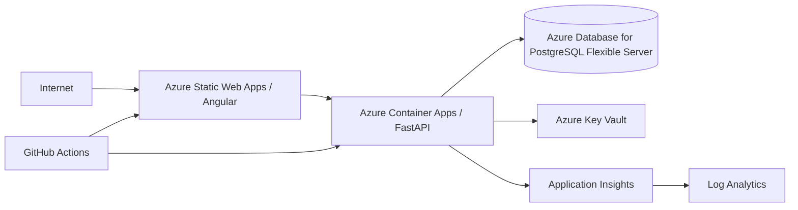

# DevOps e Azure

## Objetivo

Ter desenvolvimento local reprodutível, CI/CD auditável e uma rota clara para cloud sem acoplar o domínio ao provedor. A infraestrutura deve permanecer simples, de baixo custo e adequada a um projeto de portfólio.

## Ambientes

Os ambientes mínimos do projeto são:

| Ambiente | Finalidade | Dados | Deploy |
|---|---|---|---|
| `development` | integração contínua das mudanças aceitas | sintéticos | automático quando o pipeline estiver habilitado |
| `test` | testes automatizados, integração e validações técnicas | efêmeros/sintéticos | automático pelo pipeline |
| `staging` | homologação próxima da produção | sintéticos controlados | controlado, após CI verde |
| `production` | versão estável/publicável | somente dados permitidos | somente após gate de aprovação |

Contextos auxiliares:

- `local`: Docker + PostgreSQL local para desenvolvimento;
- `ci`: runners efêmeros do GitHub Actions, usados para lint, testes, build e security checks.

Nenhum ambiente deve depender de credenciais versionadas no repositório.

## Topologia Azure planejada

A combinação Static Web Apps + Container Apps é a preferência inicial por reduzir overhead operacional. A decisão final deve ser validada pela arquitetura antes do provisionamento.

## Infraestrutura como código

Infraestrutura manual no portal deve ser minimizada e documentada.

- Bicep ou Terraform serão avaliados antes do provisionamento;
- a decisão final pertence ao fluxo de ADR/Software Architecture;
- state files, credenciais e secrets nunca devem ser versionados;
- recursos devem ter nomes previsíveis por ambiente;
- tags mínimas: `project`, `environment`, `owner`, `managed-by`.

## CI

Fluxo mínimo obrigatório:

1. checkout;
2. dependency restore usando lockfiles;
3. lint/format check;
4. backend tests;
5. frontend tests;
6. integration/contract tests quando aplicável;
7. build Angular;
8. build da imagem FastAPI;
9. security checks;
10. publicação de artefatos quando aplicável.

Security checks devem incluir, conforme a maturidade do projeto:

- dependency audit;
- secret scanning;
- análise estática/SAST;
- scan de imagem/container antes de publicação.

Falhas em lint, testes, build ou security checks bloqueiam o avanço do pipeline.

## CD e gates

Fluxo-alvo:

`development` → `test` → `staging` → aprovação → `production`

Regras:

- deploy em `development` pode ser automático após merge em `main` quando a fase executável estiver liberada;
- `test` é promovido automaticamente pelo pipeline para validações técnicas;
- `staging` exige CI verde e deve executar smoke tests pós-deploy;
- `production` exige ambiente protegido e aprovação explícita;
- migrations são executadas de forma controlada;
- health/readiness check é obrigatório após deploy;
- uma falha de smoke/health bloqueia promoção e inicia rollback quando aplicável.

## Artefatos e versionamento

- imagens devem ser imutáveis;
- nunca usar somente `latest` como referência de release;
- tag mínima por commit SHA;
- releases podem adicionar tag semântica, por exemplo `v0.1.0-alpha`;
- o mesmo artefato aprovado deve ser promovido entre ambientes sempre que possível, evitando rebuild entre staging e production.

## Secrets e configuração

Princípios:

- configuração externa à imagem;
- secrets fora do Git;
- GitHub Actions usa GitHub Secrets/Environments somente quando necessário;
- Azure usa Key Vault ou mecanismo gerenciado equivalente;
- preferir identidade gerenciada sobre credenciais estáticas quando o serviço suportar;
- separar configurações por ambiente;
- rotação de secrets deve ser possível sem rebuild da aplicação.

## Containers

- API deve ser stateless;
- imagens devem usar base mínima e usuário não-root quando viável;
- `.dockerignore` deve reduzir contexto de build e evitar arquivos locais/sensíveis;
- health check deve refletir endpoints de liveness/readiness definidos pela API;
- frontend e backend não devem compartilhar secrets em build time sem necessidade.

## Banco

- PostgreSQL local em Docker para desenvolvimento;
- Azure Database for PostgreSQL Flexible Server como alvo cloud;
- migrations versionadas;
- backup e restore testados antes de considerar `production` operacional;
- conexão via TLS no ambiente cloud;
- princípio do menor privilégio;
- pool dimensionado ao plano do banco;
- migrations destrutivas exigem plano de rollback ou estratégia de compatibilidade.

## Observabilidade operacional

- logs estruturados em stdout;
- correlação por `request_id`/`trace_id`;
- Application Insights + Log Analytics como alvo Azure;
- OpenTelemetry como camada preferencial de instrumentação vendor-neutral;
- `/health/live` e `/health/ready` devem ser usados pelos mecanismos de health do ambiente;
- alertas mínimos: 5xx, readiness, latência, indisponibilidade do banco, falha de deploy e consumo anormal.

## Rollback

Todo deploy para `staging` ou `production` deve possuir estratégia clara de retorno.

Preferências:

1. voltar para imagem/revisão previamente conhecida como saudável;
2. evitar rollback de banco destrutivo quando a migration não for reversível;
3. usar migrations backward-compatible para reduzir risco;
4. registrar versão anterior, motivo e evidência do rollback;
5. executar smoke/health novamente após o retorno.

Azure Container Apps permite manter revisões, o que pode apoiar rollback e blue/green quando essa opção for adotada.

## Custo

P0 não assume serviços caros.

Antes de provisionar Azure:

- estimar custo mensal por ambiente;
- definir budget e alertas de custo;
- desligar/remover recursos de laboratório sem uso quando aplicável;
- preferir serviços gerenciados simples a clusters dedicados;
- não introduzir Kubernetes/AKS sem requisito técnico concreto.

## Gate atual

Enquanto o P0 documental não estiver formalmente aprovado, esta seção define somente a arquitetura operacional e os critérios de implementação. Dockerfiles, workflows executáveis e provisionamento cloud só devem ser criados após a liberação do gate correspondente.
