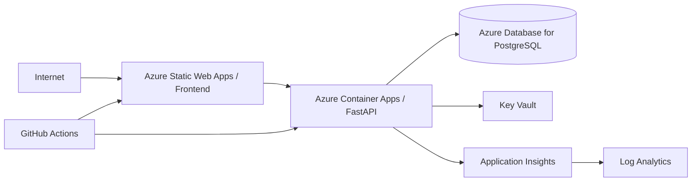

# DevOps e Azure

## Objetivo

Ter desenvolvimento local reprodutível e uma rota clara para cloud sem acoplar o domínio ao provedor.

## Ambientes

- `local`: Docker + PostgreSQL local;
- `ci`: serviços efêmeros em GitHub Actions;
- `dev`: Azure, dados sintéticos;
- `demo`: público, somente seed sintético;
- `prod`: somente se surgir implantação real, com requisitos próprios.

## Topologia Azure planejada

A escolha entre Static Web Apps e outra hospedagem front-end será validada pelo custo e limitações do momento da implementação.

## IaC

Preferência: Bicep ou Terraform, decisão por ADR antes de P3. Infraestrutura manual no portal deve ser minimizada e documentada.

## CI

Pipeline planejado:

1. checkout;
2. dependency restore com lockfiles;
3. lint/format check;
4. backend tests;
5. frontend tests;
6. integration tests;
7. build Angular;
8. build container API;
9. security scans;
10. publicar artefatos do PR quando necessário.

## CD

- merge em `main` → deploy automático em `dev`/demo quando P3 estiver ativo;
- produção, se existir, requer ambiente protegido e aprovação;
- migrations executadas de forma controlada;
- health check obrigatório após deploy;
- rollback documentado.

## Configuração

12-factor quando aplicável:

- configuração externa;
- logs em stdout estruturados;
- processos stateless na API;
- sessão/autorização não dependem de memória local do container.

## Banco

- migrations versionadas;
- backup e restore testados antes de chamar ambiente de produção;
- conexão via TLS;
- princípio do menor privilégio;
- pool dimensionado ao plano do banco.

## Custo

P0 não assume serviços caros. Antes de provisionar Azure, será criado orçamento mensal aproximado e limites/alerts de custo para ambiente de portfólio.