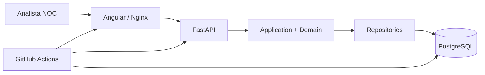
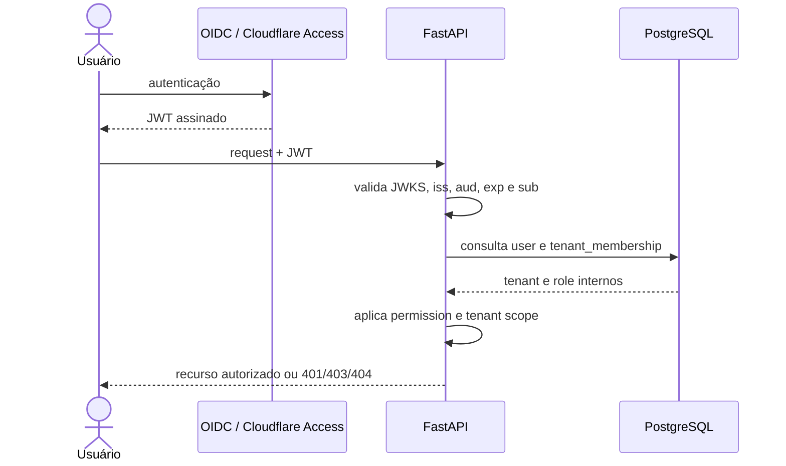

# Evidências do case — NOC Flow Cloud

> Fonte canônica para comunicar o projeto no portfólio sem transformar roadmap em entrega.
>
> Atualizado em 25/09/2026. Estado observado na branch `main`: Sprint 4 homologada para demo privada; Sprint 5 em revisão nos PRs #59 e #60.

## Estado verificável

| Capacidade | Estado | Evidência |
|---|---|---|
| Incidentes e transições | Implementado | `backend/app/modules/incidents/`, testes de API e Sprint 2 Functional Smoke |
| Timeline append-only | Implementado | eventos sem endpoints suportados de edição/exclusão e testes de regressão |
| PostgreSQL + SQLAlchemy + Alembic | Implementado | migrations e job PostgreSQL do CI |
| Angular + FastAPI | Implementado | build frontend, readiness da API e Compose |
| Docker Compose | Implementado | smoke atravessando Nginx → FastAPI → PostgreSQL |
| OIDC/JWT | Implementado | validação de JWKS, issuer, audience, expiração e subject |
| RBAC server-side | Implementado | memberships internas e permissões Admin/Supervisor/Operator/Viewer |
| Isolamento multi-tenant | Implementado | testes negativos cross-tenant |
| Dashboard operacional | Implementado e homologado para demo privada | Sprint 4 Functional Smoke e `V0.4.0-BETA-HOMOLOGATION.md` |
| Passagem de turno | Implementado e homologado para demo privada | snapshot versionado/imutável, histórico e Sprint 4 Functional Smoke |
| Auditoria persistida | Em revisão | PR #59; não pertence à baseline atual da `main` |
| Logging estruturado e correlação | Em revisão | PRs #59/#60; não pertence à baseline atual da `main` |
| Métricas, tracing e Application Insights | Planejado | Sprint 5/6; ainda sem evidência de ambiente real |
| Azure | Planejado | Sprint 6; ainda sem deployment comprovado |
| Zabbix, WhatsApp e ITSM | Backlog pós-v1.0 | documentos de integração; não implementado na release atual |

## Arquitetura executada

## Fluxo de autenticação e autorização

O token prova a identidade. A autorização final é resolvida pela aplicação com memberships internas; role e `tenant_id` enviados pelo cliente não são tratados como autoridade.

## Trade-offs explícitos

| Decisão | Benefício | Custo assumido |
|---|---|---|
| Monólito modular | deploy e debugging mais simples para o estágio atual | módulos não escalam de forma independente |
| Banco/schema compartilhados | menor custo e operação mais simples | todo acesso exige tenant scoping rigoroso |
| FastAPI | contratos OpenAPI, Pydantic e camada HTTP enxuta | menos funcionalidades administrativas prontas que um framework full-stack |
| RBAC no banco | autorização auditável e independente de claims externas | memberships precisam de ciclo de vida próprio |
| Timeline append-only | preserva a trilha operacional | correções exigem novo evento, não edição silenciosa |
| Cloudflare Access na demo | perímetro privado antes da aplicação | dependência externa e homologação real de sessão |
| PostgreSQL | transações, integridade e migrations | maior custo operacional que armazenamento em memória |
| Sem microserviços | evita distribuição prematura | extração futura exigirá contratos e migração |

## Limites atuais

- a release `v0.4.0-beta` é aprovada para ambiente local e demo privada, não para produção pública;
- Azure ainda é arquitetura-alvo;
- PR aberto ou CI verde em branch não transforma funcionalidade em entrega da `main`;
- métricas, tracing e Application Insights ainda não foram homologados;
- não existe benchmark que sustente declarar quantidade de tenants, usuários concorrentes ou incidentes por dia;
- screenshots e dados públicos do portfólio devem permanecer sintéticos;
- dados corporativos, contatos, circuitos, tokens e exports reais não entram no repositório.

## Métricas e badges

O badge de CI deve apontar para o workflow real. Quantidade de testes, cobertura e performance só podem ser publicadas quando produzidas automaticamente por pipeline reproduzível.

O CI do PR #61 mediu, em 25/09/2026, **53 testes backend aprovados**, **24 testes frontend aprovados** e **95% de cobertura de linhas no backend**. Os audits Python e npm não encontraram vulnerabilidades conhecidas. Após medir a baseline, o gate mínimo foi definido em **90%** para impedir regressão silenciosa.

Esses números descrevem uma execução identificável do pipeline e devem ser atualizados quando a baseline mudar.

## O que eu mudaria hoje

- introduzir medição de cobertura desde a primeira sprint;
- instrumentar OpenTelemetry mais cedo, mantendo o domínio vendor-neutral;
- manter teste E2E da autenticação protegida como gate humano/externo explícito;
- avaliar PostgreSQL Row-Level Security como defesa adicional, sem substituir o tenant scoping da aplicação;
- separar desde o início os adaptadores de hospedagem e integrações do núcleo de domínio.

## Minha atuação

- levantamento do problema operacional e definição dos fluxos;
- requisitos, backlog, critérios de aceite e homologação;
- arquitetura, modelagem e contratos da API;
- implementação e coordenação de frontend, backend e persistência;
- desenho de OIDC/JWT, RBAC e isolamento multi-tenant;
- estratégia de testes, CI, documentação e evidências.

Ferramentas de IA podem apoiar implementação e revisão, mas requisitos, decisões, validações e responsabilidade técnica permanecem sob condução humana.

## Gate de comunicação

Uma afirmação só pode aparecer como **entregue** quando houver código na baseline aplicável, teste/evidência correspondente e documentação coerente. Itens em PR permanecem **em revisão**; itens sem ambiente comprovado permanecem **planejados**.
